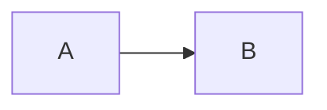

# Fixtures: Rich Markdown Rendering QA

Feature: `markdown-rendering`
Spec: MD-008 (hardening). This file records the before/after for every payload
class and the QA matrix sign-off. Output below was captured from
`renderMarkdown()` on 2026-08-13 (see `webui/src/lib/markdown/markdown.test.ts`
for the executable assertions).

## Pipeline

```
markdown source
  -> markdown-it (html:false, linkify, typographer, breaks)
       + highlight.js (highlight option)
       + katex (fence + inline/display via @vscode/markdown-it-katex)
       + mermaidPlaceholder (fence rule, base64-encoded source)
       + mediaLinks (core rule; img/video/audio + /api/files/inline rewrites)
       + link_open hardening (external links: target/rel)
  -> DOMPurify (html+mathMl profiles, allowed attrs incl. data-mermaid-source)
  -> HTML string rendered with v-html in MarkdownRenderer.vue
```

After rendering, `useMermaid().hydrate(root)` lazily loads mermaid and swaps
each `.mermaid-placeholder` div for its rendered SVG.

## Payload classes (before -> after)

### Headings / emphasis
Source:
```markdown
# Title

**bold** *italic*
```
Rendered:
```html
<h1>Title</h1>
<p><strong>bold</strong> <em>italic</em></p>
```

### Fenced code + highlight.js
Source:
````markdown
```python
print('hi')
```
````
Rendered (note the `hljs` classes; the Vue component wraps the block with a
copy button):
```html
<pre class="hljs"><code class="hljs language-python"><span class="hljs-built_in">print</span>(<span class="hljs-string">'hi'</span>)
</code></pre>
```

### Table
Source:
```markdown
| a | b |
|---|---|
| 1 | 2 |
```
Rendered:
```html
<table>
<thead><tr><th>a</th><th>b</th></tr></thead>
<tbody><tr><td>1</td><td>2</td></tr></tbody>
</table>
```

### Inline math
Source: `Euler: $e^{i\pi}+1=0$`
Rendered: KaTeX span pair - `.katex` > `.katex-mathml` (MathML for a11y) +
`.katex-html` (visual). DOMPurify keeps the required `style` attributes.
```html
<p>Euler: <span class="katex">...</span></p>
```

### Display math
Source: `$$\int_0^1 x\,dx$$`
Rendered:
```html
<p class="katex-block"><span class="katex-display"><span class="katex">...</span></span></p>
```

### Fenced math
Source:
````markdown
```math
x^2
```
````
Rendered (same `.katex-block` / `.katex-display` wrapper as display math):
```html
<p class="katex-block"><span class="katex-display"><span class="katex">...</span></span></p>
```

### Mermaid (valid)
Source:
````markdown

````
Rendered (source is base64-encoded so DOMPurify cannot strip `-->`):
```html
<div class="mermaid-placeholder" data-mermaid-source="Z3JhcGggTFIKQS0tPkI="></div>
```
After `hydrate()`: the div is replaced with mermaid's rendered `<svg>`.
Source round-trips: `decodeMermaidSource("Z3JhcGggTFIKQS0tPkI=")` ==
`"graph LR\nA-->B"`.

### Mermaid (invalid / streaming partial)
Behavior: `mermaid.render` throws; `useMermaid` catches and emits a fallback:
```html
<pre class="mermaid-error">Failed to render diagram: <error text></pre>
```
No uncaught errors during streaming (render cache keys on the source hash, so a
re-hydration of the same partial source does not throw again).

### Image (external)
Source: ``
Rendered (external URLs pass through untouched):
```html
<p></p>
```

### Image (local / workspace-relative)
Source: ``
Rendered (rewritten to the inline route; the URL is encoded):
```html
<p></p>
```

### Video (local)
Source: `[clip](outputs/v.mp4)`
Rendered:
```html
<p><video controls="" src="/api/files/inline?path=outputs%2Fv.mp4"></video></p>
```

### Audio (local)
Source: `[song](outputs/a.mp3)`
Rendered:
```html
<p><audio controls="" src="/api/files/inline?path=outputs%2Fa.mp3"></audio></p>
```

### Non-media links
- Relative: `[local](./page)` -> `<a href="./page">` (no `target`).
- Absolute external: `[link](https://example.com/page)` ->
  `<a href="https://example.com/page" target="_blank" rel="noopener noreferrer">`.

## Sanitization probes

| Probe | Result |
| --- | --- |
| `<script>alert(1)</script>hello` | `&lt;script&gt;alert(1)&lt;/script&gt;hello` (escaped as text; `html:false`) |
| `` | `&lt;img ... onerror=&quot;alert(1)&quot;&gt;` (escaped; no live element) |
| `<iframe src="https://evil.example">` | stripped (frames disabled per Phase 0; no `frame-src` in CSP) |
| inline `style` inside `.katex` | kept (`ADD_ATTR:['style']`) - KaTeX layout depends on it |
| `data-mermaid-source` after sanitize | kept (`ALLOW_DATA_ATTR:true` + explicit add) |
| fenced ` ```html\n<div>x</div>\n``` ` | `&lt;div&gt;x&lt;/div&gt;` inside `<pre>` (code content escaped) |

## QA Matrix

| # | Payload | Expected | Status |
| --- | --- | --- | --- |
| 1 | `# H1\n**bold** *italic*` | heading, bold, italic | PASS (unit + fixture) |
| 2 | fenced python | highlighted code + copy button | PASS (unit: classes; copy button: manual) |
| 3 | markdown table | rendered `<table>` | PASS |
| 4 | `$e^{i\pi}+1=0$` inline | KaTeX inline span | PASS |
| 5 | `$$\int_0^1 x\,dx$$` | KaTeX display | PASS |
| 6 | fenced ```math | KaTeX display (fenced) | PASS |
| 7 | valid ```mermaid | placeholder div -> SVG on hydrate | PASS (unit: `useMermaid.test.ts` renders real SVG) |
| 8 | malformed ```mermaid | fallback `.mermaid-error` pre | PASS (unit: `useMermaid.test.ts` emits error fallback) |
| 9 | `` | external `` untouched | PASS |
| 10 | `` | `` via `/api/files/inline` | PASS |
| 11 | `[clip](./outputs/v.mp4)` | `<video controls>` via inline route | PASS |
| 12 | `[song](./outputs/a.mp3)` | `<audio controls>` via inline route | PASS |
| 13 | `<script>alert(1)</script>` | escaped as text | PASS |
| 14 | `` | no live element | PASS |
| 15 | external link | `target="_blank" rel="noopener noreferrer"` | PASS |
| 16 | local media served by backend | 200 inline + correct MIME/Disposition | PASS (`TestInlineFileHandler`) |

Backend sign-off: `go test ./internal/web/...` green (inline route: 200/403/404/
400/401; CSP: `media-src 'self' data:`, `script-src` unchanged, no `frame-src`).

## Residual manual checks (browser)

The following need a running `hakase web` + a message that produces the payload
(e.g. have the agent emit math, a mermaid diagram, and a local image):
- Copy-button click copies raw code (unit-tested indirectly; click untested).
- Mermaid SVG visually correct and styled by the theme.
- Video/audio controls work against a real served file (no Range in v1, so
  seeking jumps the whole stream; acceptable per Phase 0).
